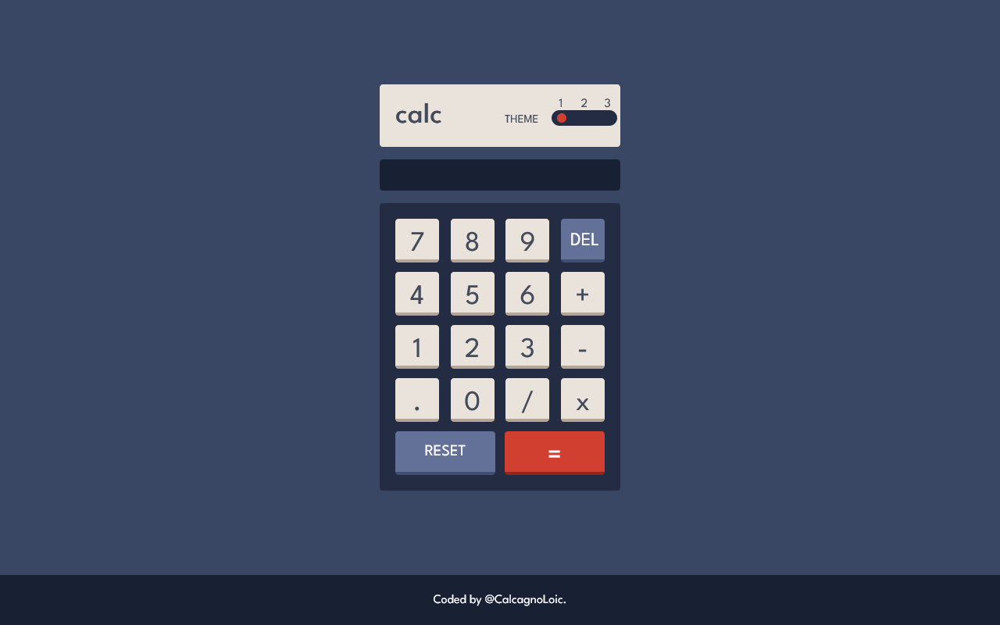
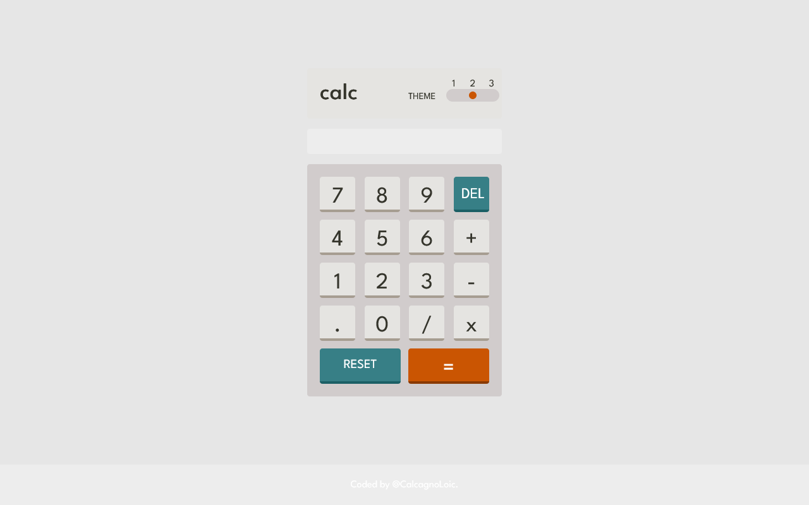
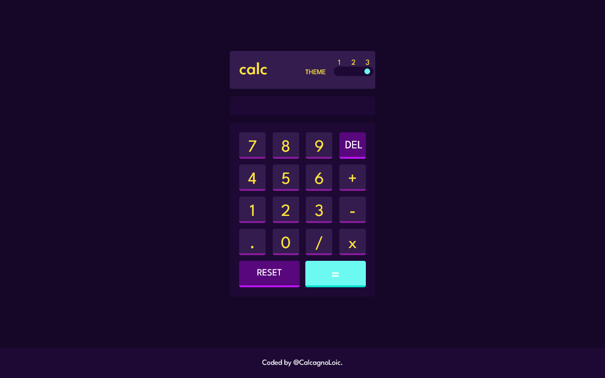

# Calculator app

  

    

Users should be able to:

- [x] See the size of the elements adjust based on their device's screen size
- [x] Perform mathematical operations like addition, subtraction, multiplication, and division
- [x] Adjust the color theme based on their preference

    
    

### Built with

- Semantic HTML5 markup
- Tailwind with custom properties
- Flexbox
- Mobile-first workflow
- Typescript

## Author

- Portfolio - [Calcagno Loïc](https://calcagno-loic.netlify.app/)
- Frontend Mentor - [@CalcagnoLoic](https://www.frontendmentor.io/profile/CalcagnoLoic)
